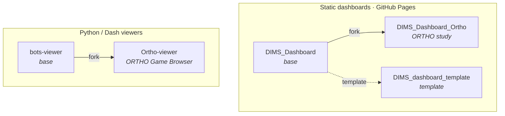

# DIMS-network

**Open tools for visualizing dynamic interaction and multimodal signals in social-interaction research.**

The DIMS Dashboard integrates audiovisual, kinematic, neural, and transcript data in one space — time series, video, transcripts, and analyses like RQA, cross-wavelet, and ELAN annotations — so qualitative and quantitative analyses of social interaction can sit side by side.

🌐 **Landing page & network diagram → [dims-network.github.io](https://dims-network.github.io/)**

---

## Repositories

| Repo | Role | Stack | Live |
|---|---|---|---|
| [**DIMS_Dashboard**](https://github.com/dims-network/DIMS_Dashboard) | Canonical base dashboard | Static · JS | [demo](https://dims-network.github.io/DIMS_Dashboard/) |
| [**DIMS_dashboard_template**](https://github.com/dims-network/DIMS_dashboard_template) | Empty "Use this template" starter | Static · JS | — |
| [**DIMS_Dashboard_Ortho**](https://github.com/dims-network/DIMS_Dashboard_Ortho) | ORTHO study — fork of the base (multi-perspective video, trajectory, DTW) | Static · JS | [demo](https://dims-network.github.io/DIMS_Dashboard_Ortho/) |
| [**bots-viewer**](https://github.com/dims-network/bots-viewer) | Trajectory + RQA/cRQA viewer for a 2-player grid game | Python · Dash | [demo](https://huggingface.co/spaces/mikub97/bots-viewer) |
| [**Ortho-viewer**](https://github.com/dims-network/Ortho-viewer) | ORTHO Game Browser — fork of bots-viewer | Python · Dash | — |

## How the repos relate

---

## Reference

Miao, G. Q., Trujillo, J., Bulls, L. S., Thornton, M. A., Dale, R., & Pouw, W. (2025).
*DIMS Dashboard for Exploring Dynamic Interactions and Multimodal Signals.*
Proceedings of the 47th Annual Meeting of the Cognitive Science Society (CogSci 2025).
